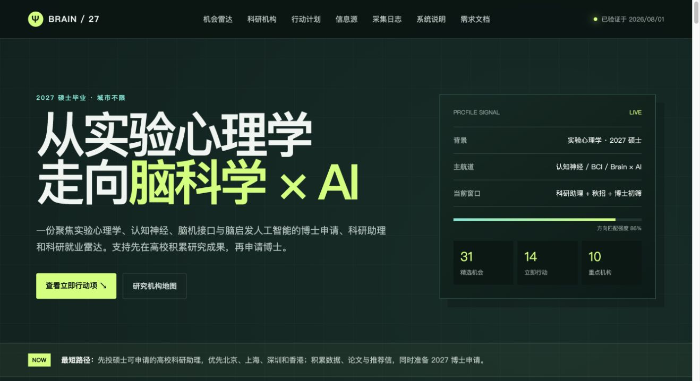
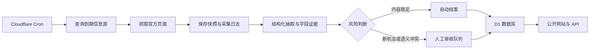

# BRAIN / 27｜2027 脑科学与人工智能机会雷达

面向 2027 年毕业的实验心理学硕士，持续汇总全球脑科学、认知神经科学、脑机接口与脑启发人工智能方向的博士、奖学金、高校科研助理和企业校招机会。

[访问线上网站](https://radar.openagent.hk) · [导师雷达](https://radar.openagent.hk/researchers) · [最新论文](https://radar.openagent.hk/papers) · [论文数据库](https://radar.openagent.hk/paper-sources) · [查看信息源](https://radar.openagent.hk/sources) · [查看采集日志](https://radar.openagent.hk/logs) · [系统说明](https://radar.openagent.hk/system) · [需求文档](https://radar.openagent.hk/prd)



## 项目简介

BRAIN / 27 不是简单的招聘链接集合，而是一套可审计、可追踪的机会情报系统。系统以高校、科研机构和企业官方页面为主要信息源，通过 Cloudflare Cron 定时检查内容变化，将来源快照、逐来源日志、候选记录、字段证据和审核结论保存在 D1 数据库中。

当前版本为 `v0.5.0`，重点覆盖：

- 英国：中国学生重点关注的 Oxford、Cambridge、UCL 等高校与研究机构；
- 中国大陆：清华、北大，以及北京、上海、深圳的高校、科研机构和科技企业；
- 中国香港：港大、港中文、港科大等高校及香港企业机会；
- 爱尔兰：高校、研究机构及跨国企业校招入口；
- 机会类型：博士、联合培养博士、科研助理、校招、实习和研究岗位；
- 资助信息：全奖、部分奖学金、混合资助、自费和待确认，并明确国际学生学费差额风险。

## 当前数据规模

| 指标 | 当前数量 |
| --- | ---: |
| 官方信息源 | 73 |
| 自动检查来源 | 67 |
| 高优先级来源 | 47 |
| 公开机会 | 31 |
| 硕士可申请的科研助理机会 | 9 |
| 重点机构 | 10 |
| 首批重点导师 | 16 |

普通来源每 24 小时检查一次；重点来源每 6 小时检查一次。受访问限制的来源仍会显示在来源目录中，并标记为人工核对。

## 核心功能

- 机会雷达：按状态、机会类型和关键词筛选博士、科研助理及就业机会；
- 导师雷达：按地区、机构、主题和研究方法跟踪 16 位重点导师及官方主页；
- 最新论文：通过 6 个学术数据库发现近 18 个月成果候选，以 DOI、PMID、PMCID、arXiv ID 去重并透明区分候选和已核验状态；
- 论文数据库：Crossref、Europe PMC、arXiv、PubMed、PMC、DOAJ 已自动接入；网页继续列出 OpenAlex、CORE 等需要配置或研究中的来源；
- 奖学金标注：展示资助类型、覆盖范围、核验时间和国际学生适用边界；
- 科研助理路径：独立标注硕士申请条件、学历要求和博士过渡价值，但不承诺受聘后自动转博；
- 信息源目录：按地区、覆盖类型、机构类型、自动状态和失败状态检索全部来源；
- 历史采集日志：查看每次运行、每个来源的 HTTP 状态、变化结果和处理数量；
- 自动稳定性观察：页面变化先进入观察，连续稳定后自动结案；新机会、解析冲突和高风险语义变化仍保留人工审核；
- 响应式页面：适配电脑、平板和手机，移动端使用单列卡片及可横向滚动的筛选栏；
- 网页文档：在线展示系统状态、运行方式、操作说明和完整 PRD。

## 自动更新流程



自动审核只处理来源页面的稳定性观察，不会在未经确认的情况下自动发布高风险机会。截止日期、开放状态、机会类型和资助信息等关键字段发生变化时，系统会保留证据并进入审核流程。

## 技术架构

- 前端与服务端：React 19、Next.js 16、vinext；
- 云端运行：Cloudflare Workers；
- 数据库：Cloudflare D1、Drizzle ORM；
- 自动任务：Cloudflare Cron Triggers；
- 资源服务：Cloudflare Assets、Images；
- 质量保障：TypeScript、ESLint、Node.js Test Runner；
- 生产域名：[radar.openagent.hk](https://radar.openagent.hk)。

## 本地开发

### 环境要求

- Node.js `>= 22.13.0`
- npm
- Cloudflare Wrangler

### 启动项目

```bash
npm install
npm run db:migrate:local
npm run dev
```

本地 D1 状态保存在 `.wrangler/state`。构建生成的 Worker 配置位于 `dist/server/wrangler.json`。

### 常用命令

| 命令 | 说明 |
| --- | --- |
| `npm run dev` | 启动本地开发服务器 |
| `npm run build` | 生成生产构建 |
| `npm run verify` | 执行类型检查、Lint、构建和全部测试 |
| `npm test` | 执行 SSR、抽取和来源监控测试 |
| `npm run db:migrate:local` | 应用本地 D1 迁移和种子数据 |
| `npm run db:generate` | 根据 Schema 生成 Drizzle 迁移 |
| `npm run cf:typegen` | 生成 Cloudflare 绑定类型 |
| `npm run deploy` | 构建并发布到 Cloudflare Workers |

## 生产部署

生产发布需要真实的 D1 数据库 ID：

```bash
npx wrangler d1 create brain-27-career-radar
export BRAIN_RADAR_D1_ID='<database-id>'
npm run build
npx wrangler d1 migrations apply brain-27-career-radar \
  --remote \
  --config dist/server/wrangler.json
npm run deploy
```

部署前应先导出远程 D1 回滚备份，迁移后核对来源数、机会数和待执行迁移，再发布 Worker 并验证自定义域名。不要提交 `.env`、访问令牌、数据库凭据或临时备份。

## 项目结构

```text
app/                 页面、组件和 API 路由
db/                  D1 数据模型与数据库访问
drizzle/             数据库迁移与种子数据
lib/p1/              来源适配、结构化抽取和风险决策
public/               公共静态资源
docs/                 PRD、架构、运维、开发和部署记录
tests/                自动化测试
scripts/              发布环境检查脚本
```

## 项目文档

- [产品需求文档](docs/PRD.md)
- [P2 学术情报雷达 PRD](docs/PRD_P2_ACADEMIC.md)
- [系统架构与设计决策](docs/ARCHITECTURE.md)
- [运行与部署操作手册](docs/OPERATIONS.md)
- [开发日志](docs/DEVELOPMENT_LOG.md)
- [部署记录](docs/DEPLOYMENT_LOG.md)
- [线上系统说明](https://radar.openagent.hk/system)
- [线上需求文档](https://radar.openagent.hk/prd)
- [线上 P2 学术情报 PRD](https://radar.openagent.hk/prd/academic)

## 信息使用边界

岗位、招生批次和奖学金信息会随时变化。系统提供的是发现、跟踪和决策辅助，申请或投递前必须再次打开机构官方页面核对截止时间、学历要求、签证条件和资助范围。

## 开源依赖

- [vinext](https://github.com/cloudflare/vinext)
- [Drizzle ORM](https://orm.drizzle.team/docs/get-started/d1-new)
- [Cloudflare Workers](https://developers.cloudflare.com/workers/)
